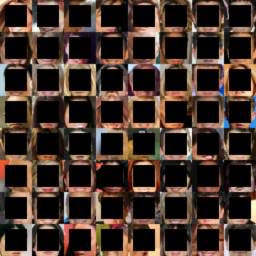
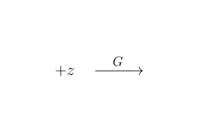
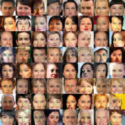
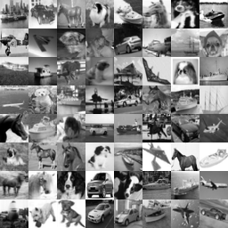
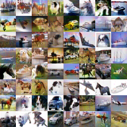

# Solving inverse problems using a DCGAN in Tensorflow

Based on work from my [Part III essay](https://drive.google.com/open?id=1V5S_EPCBNptCq54BXGLzbgWr2sGbvwHX), 
I designed framework that is based on a GAN
and can solve various inverse problems on pictures.
Some examples are below.

The code is based on the code from Taehoon Kim's DCGAN-tensorflow project: 
https://github.com/carpedm20/DCGAN-tensorflow

## Center inpainting
The architecture can be trained to recreate the center part of a picture.
The code below was used to train the model that created the following picture:
The model was trained using the following line:

First, download dataset with:

    $ python main.py --crop --train_size 60000 --problem_name problems.center_inpainting --nrof_epochs 16 --train
    

## Colouring
I also trained the model to colour black&white pictures.
The dataset I used for the following was a subset of (5 of the classes of) the cifar10 dataset.

    $ python main.py --problem_name problems.colouring_bw --dataset_name cifar10 --nrof_epochs 16 --train

    

